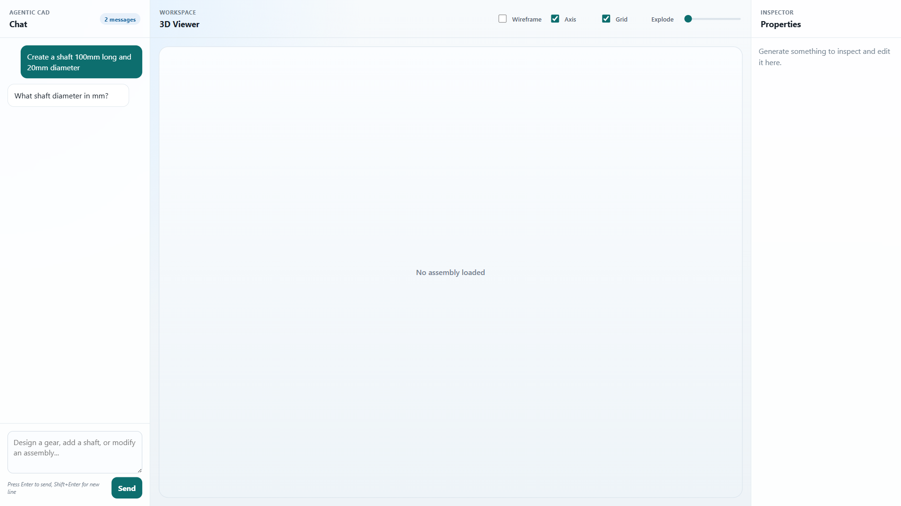
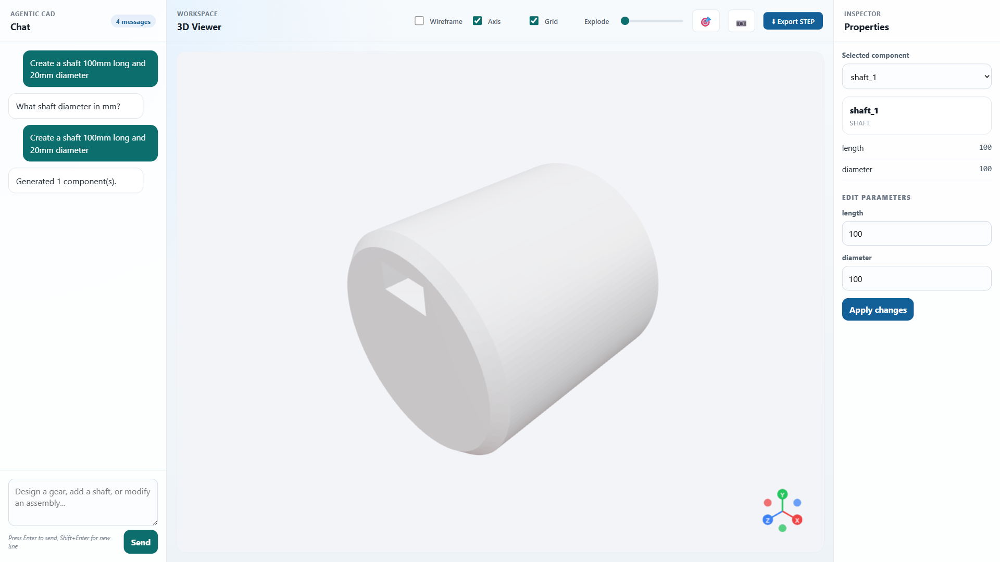
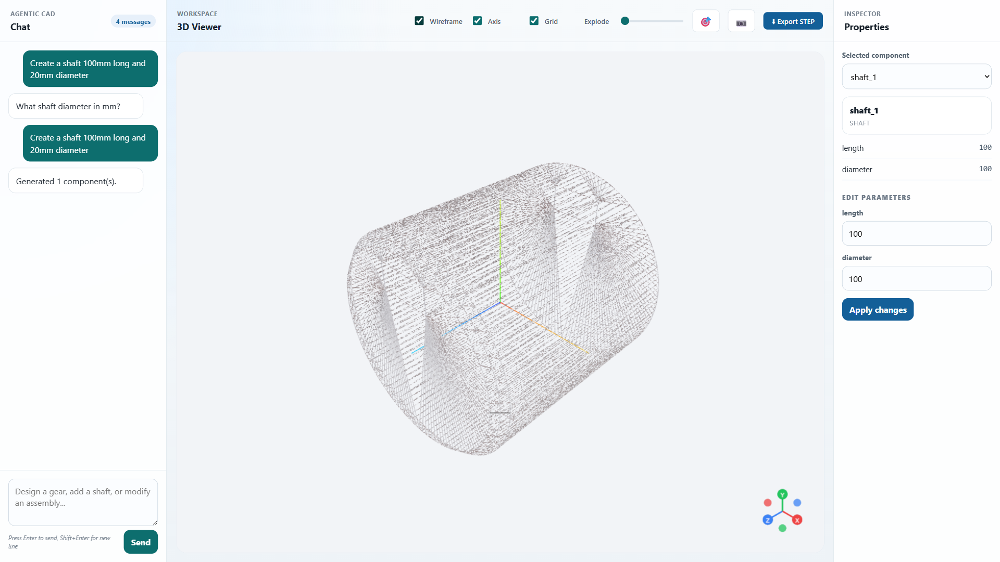
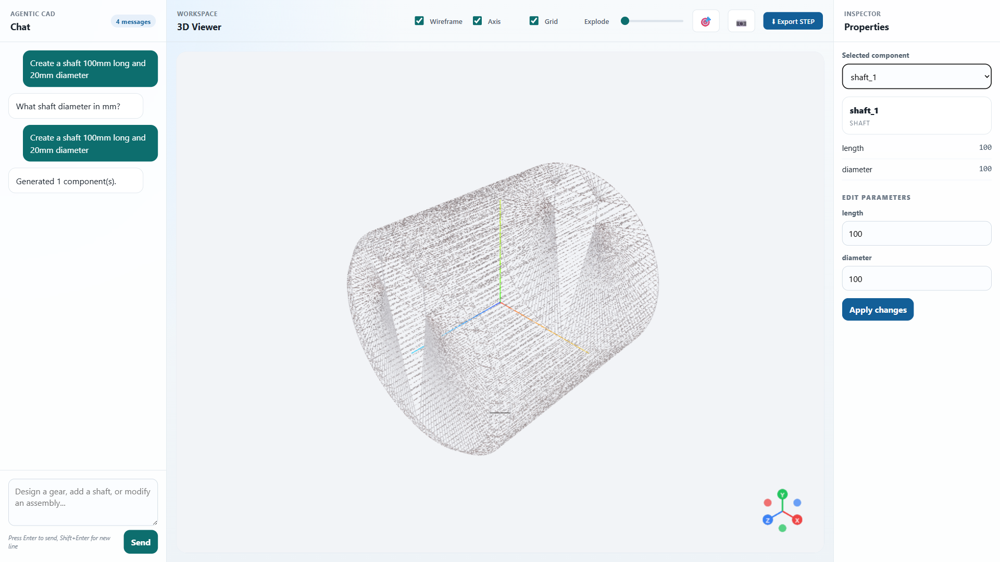
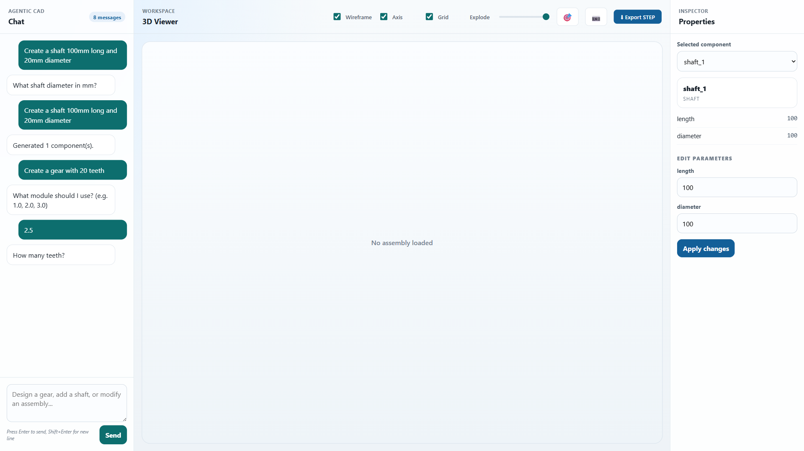

# UI Screenshots & Feature Walkthrough

This document provides a detailed visual tour of the Agentic CAD Intelligence Platform.

## Table of Contents
1. [Initial Interface](#1-initial-interface)
2. [Natural Language CAD Generation](#2-natural-language-cad-generation)
3. [3D Viewer Features](#3-3d-viewer-features)
4. [Wireframe & Inspection Tools](#4-wireframe--inspection-tools)
5. [Component Inspector](#5-component-inspector)
6. [Multi-Component Workflow](#6-multi-component-workflow)
7. [Assembly Views](#7-assembly-views)

---

## 1. Initial Interface

**What you see:**
- **Left Panel**: Chat interface for natural language input
- **Center Panel**: 3D viewer with WebGL canvas (React Three Fiber)
- **Right Panel**: Component inspector (empty until components are created)
- **Top Controls**: Wireframe, Axis, Grid toggles, Explode slider

**Key Features:**
- Clean, responsive three-column layout
- No model loaded yet - ready for your first command
- All controls disabled until components exist

---

## 2. Natural Language CAD Generation

**User Input:** *"Create a shaft 100mm long and 20mm diameter"*

**What happened:**
1. LLM parsed the natural language request
2. Extracted parameters: length=100mm, diameter=20mm
3. CadQuery engine generated the 3D geometry
4. Model exported to STEP, STL, and GLB formats
5. 3D viewer loaded and displayed the component

**Visible Features:**
- Chat shows conversation history
- 3D viewer displays the cylindrical shaft
- Camera auto-positioned for optimal view
- Controls now enabled (wireframe, export, etc.)

---

## 3. 3D Viewer Features

**Interaction Controls:**
- **Orbit**: Left mouse drag - rotate around the model
- **Pan**: Right mouse drag - move the viewport
- **Zoom**: Mouse scroll wheel - closer/farther view
- **Camera Reset**: 🎯 button restores default position

**Rendering:**
- Smooth Phong shading with realistic lighting
- Directional lights from multiple angles
- Ambient lighting for shadow detail
- 50° field of view for natural perspective

---

## 4. Wireframe & Inspection Tools

**Wireframe Toggle Active:**
- Shows edge geometry and internal structure
- Reveals construction lines and faces
- Useful for inspecting complex geometries
- Helps verify dimensional accuracy

**Additional Tools:**
- **Axis Helper**: Shows X (red), Y (green), Z (blue) axes
- **Grid**: 100x100 grid with 5mm cell spacing
- **Gizmo Viewport**: Miniature axis indicator in corner

---

## 5. Component Inspector

**Inspector Features:**
- **Component Dropdown**: Select from all generated components
- **Property Viewer**: Shows component details
  - Type (shaft, gear, bearing, etc.)
  - Dimensions
  - Material properties (if specified)
  - Position/orientation
- **Parameter Editor**: Modify values and click "Apply Changes"
- **Real-time Updates**: Changes immediately reflected in 3D viewer

**Use Case:**
- Adjust shaft diameter without regenerating
- Fine-tune positions in assembly
- Validate engineering constraints

---

## 6. Multi-Component Workflow

**User Flow:**
1. **First prompt**: "Create a gear with 20 teeth"
2. **System asks**: "What is the module?" (conversational parameter gathering)
3. **User responds**: "2.5"
4. **System generates**: Spur gear with 20 teeth, module 2.5mm

**Assembly Intelligence:**
- Shaft and gear automatically positioned
- Bearing mounts calculated from shaft diameter
- Components organized in hierarchy
- All parts visible in inspector dropdown

**Supported Components:**
- Gears (spur, helical)
- Shafts (plain, keyed)
- Bearings (deep groove ball)
- Bolts, nuts, washers
- Flanges, plates, brackets
- Housings, couplings, cylinders

---

## 7. Assembly Views

**Explode Slider (0-50mm):**
- Separates components along principal axes
- Maintains relative positioning
- Helps visualize assembly sequence
- Useful for manufacturing documentation

**Export Options:**
- **STEP**: Industry-standard CAD format (SolidWorks, Fusion 360, FreeCAD)
- **STL**: 3D printing ready
- **GLB**: Web-optimized 3D format
- **Screenshot**: 📷 button captures current view

**Assembly Features:**
- Automatic interference detection
- Mechanical constraints validated
- Bill of materials generated
- Kinematic relationships tracked

---

## Technical Implementation

### Frontend Stack
- **React** - UI framework
- **React Three Fiber** - Three.js wrapper for React
- **@react-three/drei** - Helper components (OrbitControls, GizmoHelper)
- **Vite** - Fast development build tool

### Backend Stack
- **FastAPI** - Python web framework
- **CadQuery** - Python CAD engine
- **OpenAI API** - LLM for natural language parsing
- **Pydantic** - Data validation and schemas

### Viewer Performance
- WebGL hardware acceleration
- Lazy loading of 3D models
- Optimized GLB meshes (< 2MB per component)
- 60 FPS rendering target

---

## Keyboard Shortcuts

| Shortcut | Action |
|----------|--------|
| **Enter** | Send chat message |
| **Shift+Enter** | New line in chat |
| **Scroll** | Zoom 3D view |
| **Left Drag** | Orbit camera |
| **Right Drag** | Pan camera |

---

## Usage Tips

1. **Be specific**: "Create a shaft 50mm long, 12mm diameter" works better than "make a shaft"
2. **Use standard units**: System assumes millimeters (mm) for dimensions
3. **Build incrementally**: Start with primary components, add details later
4. **Inspect before export**: Use wireframe and explode view to verify geometry
5. **Modify parameters**: Use inspector instead of recreating from scratch

---

## Next Steps

- See [EXAMPLE_PROMPTS.md](./EXAMPLE_PROMPTS.md) for more prompt ideas
- Check [QUICK_START.md](./QUICK_START.md) for setup instructions
- Review [PROJECT_ANALYSIS.md](./PROJECT_ANALYSIS.md) for architecture details

---

*Screenshots captured from Agentic CAD Intelligence Platform v2.0*
*Last updated: 2026-06-07*
